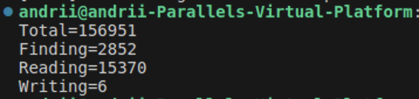
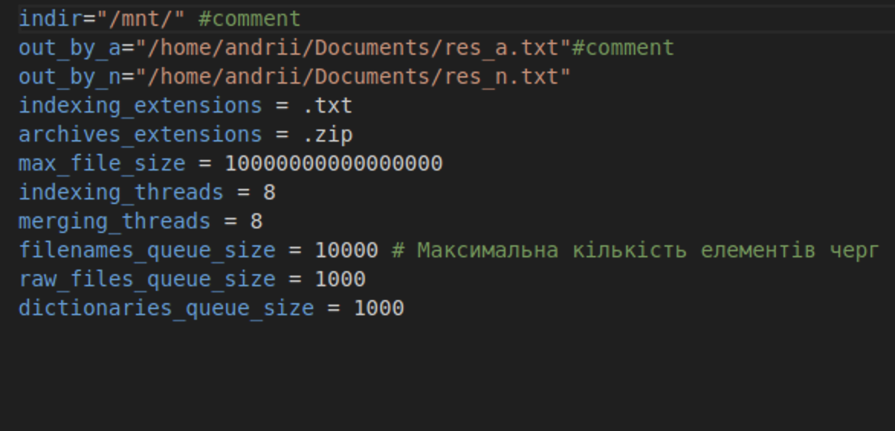
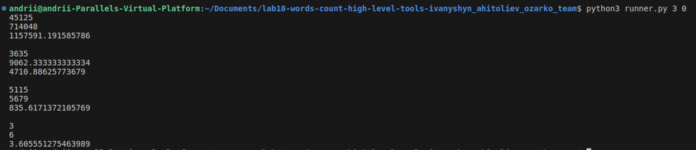
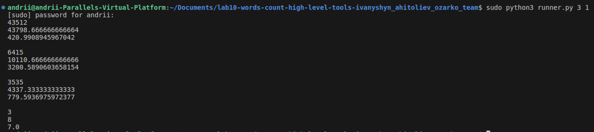

# Lab work <mark>10</mark>: <mark>Indexation</mark>
Authors (team): <mark>Андрій Агітольєв, Ігор Іванишин, Богдан Озарко</mark><br>

### Prerequisites

cmake 3.15

c++17

boost, libzip, libarchive libraries

### Compilation

Make a ```build``` directory, do ```cd build```, after that run commands ```cmake ..``` and ```make```. The project is built and executable is found in build directory. To run the program on given data, use ```./countwords_par_tbb ../first.cfg```.

### Usage

Program runs using the config file present in root directory.
Aside from executable, there is also a python script, the ```runner.py```. Usage: ```<num_of_times_to_run> <cache_flush>```. First argument determines how many times will the program be run and second is a argument asking whether to flush the cache or not (1 or 0).

Example of running the executable with ```first.cfg``` as a config file.



The cfg for this output looks like this:



These results are obtained after running program on the whole .iso archive.

How to run python script will be shown in the next section.

### Results

#### Running machine parametres

Files containing the resuts of running the executable on downloaded ISO are located here:

https://drive.google.com/drive/folders/1BBvG_ZsNGUQ0bPPRoe8pN4_1Mi03um6Y?usp=sharing

The main program and scripts were ran on Linux VM on Mac with following specifications:

Mac CPU: 3,6 GHz 10-Core Intel Core i9 Memory: 2 Gb used by VM.

#### Analysis of cache flushing impact

Let's look at two cases, fisrt picture is running  python script run 3 times for ```/mnt/3``` subdirectory of main archive with no cache flush, second, for the same directiry, with cache flush.

Not flushed:



Flush:



Main points that can be concluded from comparing these two results:

**Total Time:**

Impact:

Mean Decrease: 45125 - 43512 = 1613 ms

Standard Deviation Decrease: 714048 - 43798.67 = 670249 ms

**Finding Time**

Impact:

Mean Increase: 6415 - 3635 = 2780 ms

Standard Deviation Increase: 10110.67 - 9062.33 = 1048.34 ms

**Reading Time**

Impact:

Mean Decrease: 5115 - 3535 = 1580 ms

Standard Deviation Decrease: 5679 - 4337.33 = 1341.67 ms

**Writing Time**

Impact:

Mean: No change

Standard Deviation Increase: 8 - 6 = 2 ms

**Key Impacts of Cache Flushing:**

The total time slightly decreases and becomes more consistent with cache flushing. This suggests that overall performance might benefit from a stable cache state.

Finding operations are significantly impacted by caching, with substantial increases in both mean time and variance when caches are flushed. This stage benefits significantly from the cache.

Reading operations appear to slightly benefit from cache flushing.

Almost no impact for Writing.

#### Performance analysis using perf tools

As in previous lab, the results from preformance analysis are almost the same. A considerable portion of the overhead is in the International Components for Unicode (ICU) libraries. Noticeable overhead is observed in standard library functions and memory management routines. Frequent usage of multithreading libs and string manipulation.

#### Comparison with previous implementations

Comparing to regular muiltithreading implementation from lab 8, lab 10 shows circa 1.5 times total time improvement in speed (~245s vs ~157s for lab 8 and lab 10 respectively).

However, when comparing lab 9 results to lab 10, lab 10 is 1.5 times slower.
