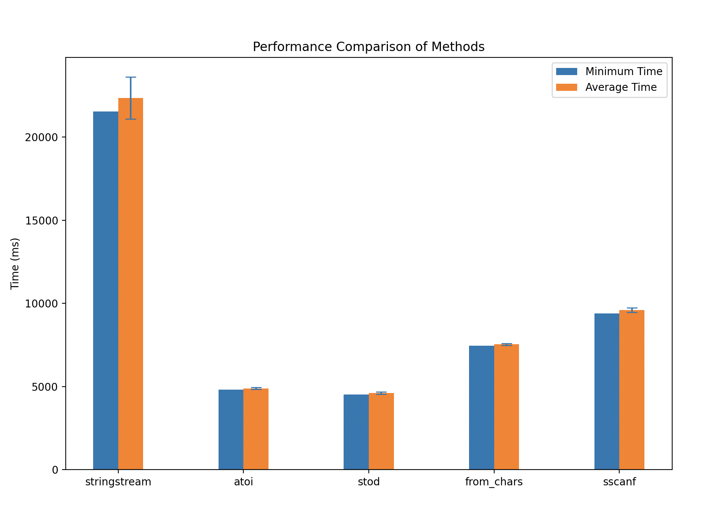

# Lab work <mark>2</mark>: <mark>Productivity Comparison</mark>
Authors (team): Андрій Агітольєв, Ігор Іванишин
## Prerequisites

OS: Linux, MacOS, Windows

### Compilation

In order to compile the program, first create and then navigate to ```build``` directory and run ```cmake ..```, after that ```make```.

The executable files will be found in the same directory.

### Usage

To test the programs, follow the Google Drive link: https://drive.google.com/drive/folders/1_3mY0o-WibAHedQWWkz-c5udWPvNuWQ4?usp=sharing.
There is a file used as a data set of numbers to test productivity.

Python script ```generate.py``` in ```utility``` was used to generate the data file.

To run the executables, after steps made in **Compilation**, type command as in following template: ```./cxx_perf_io <your_data_file> <method_number>``` (for the first task).
Example of output (multiple runs):


To run the python script, navigate to the ```utility``` folder and run such command (for the second script):
```python3 ./program2_runner.py ../data/data.txt 10 0 pvalues2.csv```

Example output:


### Results

#### p-values

Here let's look at the analysis of outputs given. First let us analyse the p-values that were calculated in the script. Following picture will be shown regarding the first five methods (reading the string vector from file) as the values are the same for the first five and other five methods.


Diagonal entries are the same - that is expectable, no need to compare function with itself here.

The Wilcoxon two-sided rank test (was used here) is a non-parametric statistical test used to compare the distributions of two samples. In our case we compare pairs of functions as two samples.

A p-value of approximately 0.002 for all the pairwise comparisons indicates that there is a statistically significant difference in the time results between the methods. The p-value of 0.002 is also below the commonly used significance level of 0.05, suggesting that the differences in the time results between the methods are highly unlikely to have occurred by chance.

Thus, the 5 methods we tested have significantly different performance characteristics in terms of their execution times.

#### Time plots, cache flush/no flush comparison

Let us look at the different plots of times for different methods, also depicting how cache flush influenced the results.

Program 1, no flush:


Program 1, flushed:


Program 2, no flush:


Program 2, flushed:



**Program 1, No Cahe Flush:**

1. Large_file method had the best performance.
2. as_string method was the second-best (minimum 16,000 ms, average 18,000 ms).
3. idiomatic and stream_iter methods had the poorest performance.

**Program 1, Cache Flushed:**

1. Large_file method remained at the top, though with a slight decrease in performance (minimum 15,000 ms, average 16,000 ms).
2. as_string method also saw a minor decrease in performance.
3. idiomatic, read_in_memory, and stream_iter methods had consistently poor performance.

Large_file and as_string methods had the best overall performance.
Idiomatic, read_in_memory, and stream_iter methods lagged behind the other methods.
Cache flushing had a slight impact on the performance of some methods, but did not significantly alter the relative speed of the different approaches.

**Program 2, No Cache Flush:**

1. The "stringstream" method has the highest minimum and average execution times, indicating it is the slowest among the five methods.
2. The "from_chars" method has the lowest minimum and average execution times, making it the fastest method.
3. The other three methods ("atoi", "stod", and "sscanf") exhibit similar performance characteristics, falling in between the extremes of "stringstream" and "from_chars".

**Program 2, Cache Flushed:**

When the cache is flushed, the execution times for all methods increase significantly compared to the "No Flush".
The overall performance trends are similar, with "stringstream" being the slowest and "from_chars" being the fastest.

However, the minimum and average execution times for each method are higher with the cache flushed.
The error bars have also increased in size, indicating higher variability in the execution times when the cache is not available.

**General remarks on cahe flushing**

The cache utilization has a significant impact on the performance of these methods. When the cache is not available (cache flushed), the methods need to fetch data from the main memory, resulting in much longer execution times.