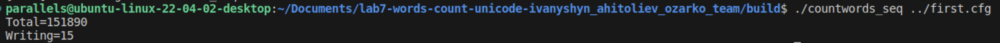
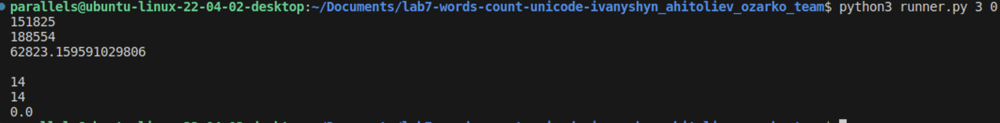
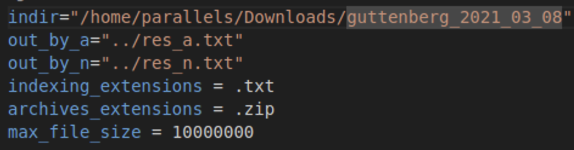
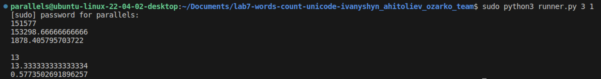

# Lab work <mark>7</mark>: <mark>Indexation</mark>
Authors (team): <mark>Андрій Агітольєв, Ігор Іванишин, Богдан Озарко</mark><br>
## Prerequisites

cmake 3.15

c++17

boost, libzip, libarchive libraries

### Compilation

Make a ```build``` directory, do ```cd build```, after that run commands ```cmake ..``` and ```make```. The project is built and executable is found in build directory. To run the program on given data, use ```./countwords_seq ../first.cfg``` (previoudly go to the ```build``` directory).

Example of running the command:



### Usage

Program runs using the config file present in root directory.
Aside from executable, there is also a python script, the ```runner.py```. Usage: ```<num_of_times_to_run> <cache_flush>```. First argument determines how many times will the program be run and second is a argument asking whether to flush the cache or not (1 or 0).

Exampleof running ```python3 runner.py 3 0```:



To get the results presented the following config file structure was used:



### Results

Files containing the resuts of running ```countwords_seq``` on downloaded ISO are located here:

https://drive.google.com/drive/folders/1BBvG_ZsNGUQ0bPPRoe8pN4_1Mi03um6Y?usp=sharing

The main program and scripts were ran on Linux VM on Mac with following specifications:

Mac CPU: 3,6 GHz 10-Core Intel Core i9
Memory: 2 Gb used by VM

#### Analysis of impact of cache flushing

Let's see two otputs, first one without flushing the cache, second one with:




Comparing two results, it can be concluded that:

Reading operations:

Without cache flushing, the average time for reading operations is higher (188554) compared to with cache flushing (~153299).
The standard deviation for reading operations without cache flushing (~62823) is significantly higher than with cache flushing (~1878). That says directly about a larger variation in execution times.

Writing operations:

The average time and minimum time for writing operations are slightly higher with cache flushing compared to without cache flushing, but not higher enough to draw significant conclusions (the difference is only 1 ms).
The standard deviation for writing operations with cache flushing (~0.57) indicates some variation in execution times, whereas without cache flushing, there is no variation (just 0.0).

Overall, if the program is more read-intensive, cache flushing would likely provide better performance and consistency. However, if program is more write-intensive, disabling cache flushing may be preferable.

#### Analysis of performance (using 'perf')

The working directory includes a ```perf_report.txt```, which contains data for performance analysis.

Based on the perf report command output, it can be concluded that program spends significant amount of time on these operations:

File I/O operations:

A substantial portion of the time is spent in system calls related to reading files (read, __x64_sys_read, ksys_read, ...). Significant time is also spent in system calls related to directory operations (__x64_sys_getdents64, iterate_dir, ext4_readdir, ext4_dx_readdir, ext4_htree_fill_tree, htree_dirblock_to_tree).
Also on file metadata operations (__GI___fstatat64, __x64_sys_newfstatat, __do_sys_newfstatat, vfs_fstatat, vfs_statx, filename_lookup, path_lookupat).


ICU Library:

A considerable portion of the time is spent in various functions from the ICU library (icu_70::UnicodeString::~UnicodeString, icu_70::UnicodeString::copyFrom, icu_70::DateFormatSymbols::~DateFormatSymbols, ...).

Memory Management:

Time is spent in memory allocation and deallocation functions (_int_malloc, _int_free, __memmove_avx_unaligned_erms, malloc, cfree@GLIBC_2.2.5).

Other blocks that use significant time are String operations and Kernel operations.

Program relies I/O, as expected from the given task. A significant amount of time is spent in file reading, directory traversal, and file metadata operations. Additionally, the use of the ICU library for Unicode-related operations seems to be consuming a lot of time. 

In percentages, it is roughly like that:

File I/O Operations (~43%)

ICU Library (~29%)

Memory Management (~6%)

String Operations (~5%)

Directory Operations (~5%)

Others (Kernel, Directory, Metadata operations) (~17%)