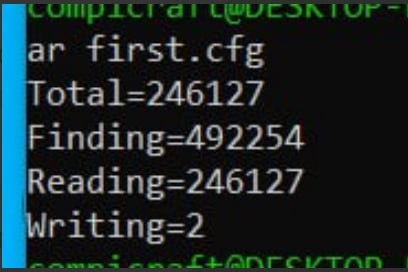

# Lab work <mark>8</mark>: <mark>Indexation</mark>
Authors (team): <mark>Андрій Агітольєв, Ігор Іванишин, Богдан Озарко</mark><br>
## Prerequisites

cmake 3.15

c++17

boost, libzip, libarchive libraries

### Compilation

Make a ```build``` directory, do ```cd build```, after that run commands ```cmake ..``` and ```make```. The project is built and executable is found in build directory. To run the program on given data, use ```./countwords_par ../first.cfg``` (previously go to the ```build``` directory).

Example of running the command:



### Usage

Program runs using the config file present in root directory.
Aside from executable, there is also a python script, the ```runner.py```. Usage: ```<num_of_times_to_run> <cache_flush>```. First argument determines how many times will the program be run and second is a argument asking whether to flush the cache or not (1 or 0).

Exampleof running ```python3 runner.py 3 0```:


To get the results presented the following config file structure was used:


### Results

#### Analysis of impact of cache flushing

Let's see two otputs, first one without flushing the cache, second one with:


Comparing two results, it can be concluded that:

Results for the no flush version show that the Total, Finding and Reading are slightly higher for this case, showing speed improvement after cache flushing. Writing remained at relatively same speed.

#### Analysis using 'perf'

Perormance analysis was done for a smaller directory from the archive, about ~50Mb.
This is what the perf_report.txt showed:

Based on this analysis, the multi-threaded program spends a significant portion of its time (27.64%) in the ICU library, particularly in functions related to Unicode string handling, character encoding, and text processing. Additionally, a considerable amount of time (9.71%) is spent in counting and processing words, which is expected given the nature of program (same can be said about ICU).

Memory management operations, such as memory allocation, deallocation, and data movement, account for 6.15% of the execution time. Hashing and string operations (4.41%) are also notable.

Kernel operations (7.26%), such as interrupt handling, context switching, and memory management, consume a noticeable portion of the execution time, as is typical for multi-threaded programs.

Overall, the ICU library and word counting/processing operations appear to be the primary in the program.
