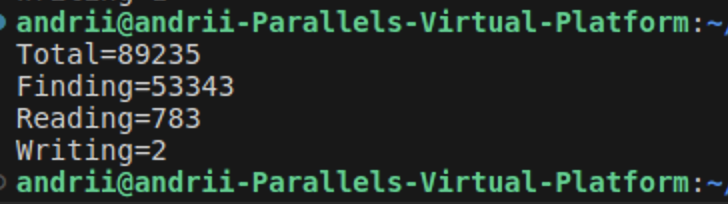
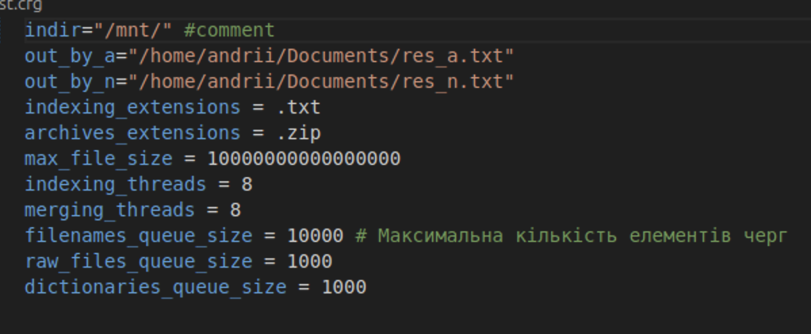
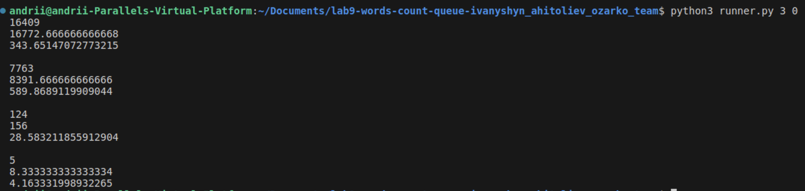
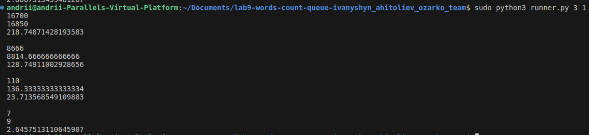

# Lab work <mark>9</mark>: <mark>Indexation</mark>
Authors (team): <mark>Андрій Агітольєв, Ігор Іванишин, Богдан Озарко</mark><br>
### Prerequisites

cmake 3.15

c++17

boost, libzip, libarchive libraries

### Compilation

Make a ```build``` directory, do ```cd build```, after that run commands ```cmake ..``` and ```make```. The project is built and executable is found in build directory. To run the program on given data, use ```./countwords_par_proftools ../first.cfg```.

### Usage

Program runs using the config file present in root directory.
Aside from executable, there is also a python script, the ```runner.py```. Usage: ```<num_of_times_to_run> <cache_flush>```. First argument determines how many times will the program be run and second is a argument asking whether to flush the cache or not (1 or 0).

Example of running the executable with ```fisrt.cfg``` as a config file.



The cfg for this output looks like this:



These results are obtained after running program on the whole .iso archive.

How to run python script will be shown in the next section.

### Results

#### Running machine parametres

Files containing the resuts of running the executable on downloaded ISO are located here:

https://drive.google.com/drive/folders/1BBvG_ZsNGUQ0bPPRoe8pN4_1Mi03um6Y?usp=sharing

The main program and scripts were ran on Linux VM on Mac with following specifications:

Mac CPU: 3,6 GHz 10-Core Intel Core i9 Memory: 2 Gb used by VM.

#### Analysis of cache flushing impact

Let's look at two cases, fisrt picture is running  python script run 3 times for ```/mnt/3``` subdirectory of main archive with no cache flush, second, for the same directiry, with cache flush.

Not flushed:



Flush:



Main points that can be concluded from comparing these two results:

**Total Time:**

Increase in mean time from 16409 to 16700.

Standard deviation decreases from 343.65 to 218.75.

Impact: Cache flushing increases the overall execution time, showing that the program benefits from cache when it isn't flushed. The reduced standard deviation in the cache-flushed scenario suggests more consistent performance with cache-flushing.

**Finding Time:**

Increase in mean time from 7763 to 8666.

Standard deviation decreases from 589.86 to 128.75.

Impact: This stage experiences a significant increase in execution time when the cache is flushed, indicating heavy reliance on cached data. The reduced standard deviation upon flushing indicates more consistent performance without cache benefits.

**Reading Time:**

Mean time decreases slightly from 124 to 110.

Standard deviation decreases from 28.58 to 23.71.

Impact: Reading time decreases slightly with cache flushing, the time measurements can fall under the scope of standard deviation, which shows little significance to analysis. This could be due to caching effects that sometimes introduce variability in reading small files or initial overheads not being representative in repeated small operations.

**Writing Time:**

Increase in mean time from 5 to 7.

Standard deviation decreases from 4.16 to 2.64.

Impact: Writing time increases slightly with cache flushing, showing a minor dependency on cache. The higher standard deviation without cache flushing suggests some variability when cache is used.

**Finding** operation is the most affected by cache flushing. The significant increase in time for finding operations indicates that they heavily benefit from caching. **Total Time** increase indicates overall performance decrease when the cache is flushed. **Reading** and **Writing** operations show less impact from cache flushing compared to finding and total time.

#### Performance analysis using perf tools

For perf analysis smaller directory was chosen inside the archive.

After running a perf report command and comverting results to a .txt file (can be found in the root directory: ```report.txt```).

Following key points can be concluded from looking at the results:

**ICU:**

A considerable portion of the overhead is in the ICU libraries (libicuuc.so and libicui18n.so), specifically:
icu_72::UnicodeString::copyFrom (~7.74%)
icu_72::UnicodeString::~UnicodeString (~4.39%)
icu_72::UnicodeString::releaseArray (~3.02%)
These functions indicate that Unicode string manipulations and their memory management are significant consumers of CPU time, which is not surprising given the natire of the program.

**Standard Library and Memory Management Functions**

Noticeable overhead is observed in standard library functions and memory management routines:
__memmove_avx_unaligned_erms (5.76%)
pthread_mutex_lock (2.64%) and pthread_mutex_unlock (1.64%)
Memory allocation routines (malloc, _int_malloc, _int_free, cfree, etc.) adding up to around 10%)
These suggest that the program does a significant amount of memory allocation, deallocation, and string operations.

**Locks:**

Functions like pthread_mutex_lock and pthread_mutex_unlock indicate a degree of thread synchronization

The perf profiling of the program highlights that a significant portion of CPU time is spent on Unicode string management, memory allocation, and thread synchronization.
